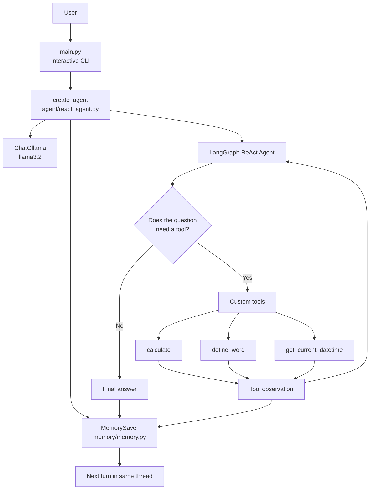

# ReAct Agent with Custom Tools

A LangGraph project that demonstrates a ReAct agent using a local Ollama model, three custom tools, and conversation memory.

The agent receives a user question, decides whether a tool is needed, executes the selected tool when necessary, observes the result, and returns a final answer. The interactive program prints this process so the ReAct loop is visible during a demonstration.

## Assignment Requirements

This project implements the requested features:

| Requirement | Implementation |
| --- | --- |
| ReAct agent | `create_react_agent` in `agent/react_agent.py` |
| Local Ollama model | `ChatOllama` using the `llama3.2` model |
| Calculator tool | `tools/calculator.py` |
| Dictionary tool | `tools/dictionary.py` |
| Date/time tool | `tools/datetime_tool.py` |
| Conversation memory | `MemorySaver` in `memory/memory.py` |
| ReAct trace | `display_agent_response` in `main.py` |
| Five test scenarios | `tests/test_agent.py` |
| Multi-turn memory demonstration | `tests/test_memory.py` |

## Architecture



### Runtime flow

1. `main.py` reads a question from the terminal.
2. It invokes the agent with a `messages` list containing the user message.
3. The agent sends the question and available tool definitions to Ollama.
4. The model either returns an answer directly or emits a tool call.
5. LangGraph executes the selected tool and adds its result as a tool observation.
6. The model uses the observation to produce the final answer.
7. `main.py` prints the user message, tool decision, action, observation, and final answer.
8. `MemorySaver` stores the message history under the configured `thread_id`.

The loop can be summarized as:

```text
Think/decide -> Act with a tool -> Observe the result -> Answer
```

The model's internal hidden reasoning is not printed. The visible trace shows the observable ReAct events: tool decisions, tool calls, observations, and final answers.

## Project Structure

```text
.
|-- main.py                    Interactive CLI and trace display
|-- requirements.txt           Python dependencies
|-- README.md                  Project documentation
|-- agent/
|   |-- __init__.py            Public create_agent export
|   `-- react_agent.py         Ollama, tools, prompt, and graph setup
|-- memory/
|   |-- __init__.py            Public create_memory export
|   `-- memory.py              MemorySaver factory
|-- tools/
|   |-- __init__.py            Tool exports
|   |-- calculator.py          Safe arithmetic tool
|   |-- dictionary.py          Mock dictionary tool
|   `-- datetime_tool.py       Local date/time tool
|-- tests/
|   |-- test_agent.py          Five-question demonstration
|   `-- test_memory.py         Multi-turn memory demonstration
`-- outputs/
	`-- test_results.txt       Generated test output
```

## Custom Tools

### `calculate(expression: str)`

The calculator parses the expression with Python's `ast` module and evaluates only approved numeric constants and operators:

- Addition: `+`
- Subtraction: `-`
- Multiplication: `*`
- Division: `/`
- Exponentiation: `**`
- Modulo: `%`
- Unary plus and minus

It does not call Python's unrestricted `eval`. Invalid syntax, unsupported operators, and overly large exponents return a readable calculation error.

Example question:

```text
What is 245 * 36?
```

### `define_word(word: str)`

This tool performs a case-insensitive lookup in the custom dictionary. It currently contains entries such as `photosynthesis`, `python`, `machine learning`, and `artificial intelligence`.

Example question:

```text
What does photosynthesis mean?
```

If a word is not in the dictionary, the tool returns a message explaining that no custom definition is available.

### `get_current_datetime()`

This tool returns the local date and time from the machine running the program in the format `YYYY-MM-DD HH:MM:SS`.

Example question:

```text
What is the current date and time?
```

## Conversation Memory

`memory/memory.py` creates an in-memory `MemorySaver`. The agent receives a configuration containing a thread identifier:

```python
config = {
	"configurable": {
		"thread_id": "demo-session"
	}
}
```

Every invocation using `demo-session` shares the previous messages. A different thread identifier starts an independent conversation.

The memory is process-local and temporary. It is cleared when the Python process stops. It is suitable for this assignment demonstration, but a database-backed checkpointer would be needed for persistent production memory.

## Setup

### Prerequisites

- Python 3.10 or newer
- Ollama installed and running
- The `llama3.2` Ollama model

The repository already contains a virtual environment named `reactvenv`. If it is not available on another machine, create one first:

```powershell
python -m venv reactvenv
```

Activate it in PowerShell:

```powershell
.\reactvenv\Scripts\Activate.ps1
```

Or activate it from Command Prompt:

```bat
reactvenv\Scripts\activate.bat
```

Install the Python dependencies:

```text
python -m pip install -r requirements.txt
```

Download the model:

```text
ollama pull llama3.2
```

If Ollama is not already running, start it in a separate terminal:

```text
ollama serve
```

## Run the Interactive Agent

Run these commands from the project root, the directory containing `main.py`:

```text
reactvenv\Scripts\activate
python main.py
```

Ask questions interactively. Type `exit` to stop.

A tool-using interaction looks like this conceptually:

```text
[USER]
What is 245 * 36?

[AGENT DECISION]
Tool required: calculate
Action: calculate({'expression': '245 * 36'})

[OBSERVATION]
Tool: calculate
Result: 8820

[FINAL ANSWER]
The result of 245 * 36 is 8820.
```

## Run the Demonstrations

Run module commands from the project root so imports resolve correctly.

### Five-question ReAct demonstration

```text
python -m tests.test_agent
```

The scenarios cover:

1. Calculator tool usage.
2. Dictionary tool usage.
3. A general question intended to be answered directly.
4. Another general question intended to be answered directly.
5. Tool output combined with additional reasoning.

The script records actions, observations, and final answers in `outputs/test_results.txt`.

### Memory demonstration

```text
python -m tests.test_memory
```

This demonstration stores a user's name and learning topic in one thread, then asks for both facts in later turns.

## Model-Dependent Behavior

The tool-selection decision is made by the Ollama model. The agent prompt explains the intended routing:

- Use `calculate` for arithmetic.
- Use `define_word` only for explicit definition requests.
- Use `get_current_datetime` for current date/time questions.
- Answer general knowledge questions directly.

Small local models may still call a tool for a general question. The trace and generated test output make that behavior visible. This is a model-selection issue rather than a missing LangGraph component. A stronger instruction-following model may follow the intended direct-answer routing more consistently.

## Troubleshooting

### `ModuleNotFoundError: No module named 'langgraph'`

The global Python interpreter is being used instead of the project environment. Activate `reactvenv` or invoke its interpreter directly:

```text
reactvenv\Scripts\python.exe -m tests.test_memory
```

### `ModuleNotFoundError: No module named 'agent'`

Run test modules from the project root:

```text
python -m tests.test_agent
```

Do not run `python tests/test_agent.py`, because direct script execution changes Python's import path.

### Ollama connection errors

Confirm that Ollama is running and that the model exists:

```text
ollama list
ollama pull llama3.2
```

## Learning Summary

This project demonstrates the main progression from a normal chatbot to a tool-using agent:

```text
User question
	-> LLM decision
	-> Optional tool call
	-> Tool observation
	-> Final response
	-> Thread memory for the next turn
```

The important design boundary is that the model chooses *whether* a tool is needed, while the Python tool implementation controls *how* the operation is safely performed.
